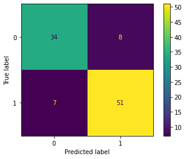

# Heart Disease

This repository was created for tutorial purposes on exploratory data analysis, creating models, tuning models, and evaluating those models from the Heart Disease dataset. A local health clinic in Atlanta, GA wants a unique insights for classifying whether their patients have heart disease or not based on certain features.

Tutorial Blog: Tavera Analytics - Heart Disease

Juana Tavera

## Business Understanding & Problem
The business problem at hand is that Heart Healthy Clinic (stakeholder - local health clinic) is looking for a model that will classify whether a patient has heart disease minimizing error. This model will lend a hand to their overbooked and busy doctors - reducing their workload. Therefore Tavera Analytics' goal was to analyze, create models, and fine tune them to minimize false negatives.

False negative: Not diagnosing a patient with heart disease when in actuality the patient does have heart disease.

## Data Analysis - Inital Setup 
The dataset heart.csv was used for data analysis and modeling. 

heart.csv has 14 columns and 303 entries. This a fairly small dataframe (since it is usually used for academic purposes), realized that keeping all the columns was necessary to keep as much data as possible.

# Results 

## heart_disease_modeling

The first and largest section of this notebook is the Exploratory Data Analysis (EDA) since there are no null values and there are no columns that could be dropped. 


A correlation heatmap to see which features have a higher correaltion (postive or negative) with the target variable output: 0 less chance of heart disease and 1 more chance of heart disease. 

From the heatmap can see that variables cp, thalachh, slp have the highest positive correlation and exng, oldpeak, caa, thall have the highest negative correlation.

### Highest Positive Correlation 


With the patient that has typical angina there are less likely to have heart disease, however when they have atypical angina or non-anginal pain there are more likely to have heart disease.


Thalachh: maximum heart rate achieved, typical resting heart rate in adults is 60 - 100 beats per minute.

People who do not have heart disease have a larger range between the maximum heart rate achieved from 71 to 195 and most of the values were within 156 bpm. Their mean thalacch was at 139.1. However the people who do have heart disease the range was smaller but typically the thalachh was also higher from 96 to 202 and most of the values were within 172 bpm. The mean for people who did have heart disease was also higher at 158.47 bpm.


Slope: the slope of the peak exercise ST segment (it corresponds to the area from the end of the QRS complex to the beginning of the T wave)

0 = unsloping
1 = flat
2 = downsloping

On average people who do not have a heart disease their thalachh is lower compared to those who do have heart disease across the slopes. The people whose slope was downsloping tend to have a higher thalachh in general no matter if they have a heart disease or not. The person who had the highest thalachh at 220 and has heart disease also had a downsloping ST segment.

### Highest Negative Correlation


It was negatively correlated; therefore, the people who did not have exng were more likely to be diagnosed with heart disease.


Oldpeak: ST depression induced by exercise relative to rest This relationship between oldpeak and exng:

- when exng is no there is a larger range in oldpeak
- people who do have heart diesease tend to have a lower range in oldpeak


Fluoroscopy: an imaging technique that uses X-rays to obtain real-time moving images of the interior of an object

From the correlation heatmap - saw that caa was negatively correlated therefore it makes sense that when caa is equal to 0 than the output has higher heart disease value.


Thalessemia: a genetic blood disorder that is characterized by a lower rate of hemoglobin than normal

- 0 = null
- 1 = fixed defect
- 2 = normal
- 3 = reversable defect

As the plot shows when thall was equal to 2 i.e normal, people were diagnosed with heart disease with three (reversable defect) coming in second. This makes sense since thalessemia is relatively rare in the world with it effecting only 1.8% of the global population. Here is a [link](https://www.ncbi.nlm.nih.gov/pmc/articles/PMC2893117/) explaining the disorder in detail.

## Dummy Model 

Before I created the DummyClassifier I checked to see how the class balance was just to make sure there wasn't a major class imbalance. 
0 = 138
1 = 165


The Dummy Model for a Classifier is usually the most frequent. So this dummy model would predict the majority class, in this case 1, more likely for the patient to have heart disease. This model does not have any false negatives nor any true negatives since the model predicted a one everytime. The recall score for this model was 100% since there weren't any fasle negatives. As shown above can see that the model predicted 107 true positives and 96 fasle positives.

Recall Score: true positive/(true positive + false negative)


## Decision Tree - Feature Importance


The next model that was created was a DecisionTreeClassifer since the models are a good starting model and can be used for feature importance based on the splits that they make. One of the downsides to a DecisionTree is that they are prone to overfitting which can be shown is the train and test accuracy score - a 92% and 74% score respectively. The recall score for the test set was also not very good sitting at a 67%. As shown above in the confusion matrix for the Decision Tree, the model predicted 35 true negatives, 39 true positives, 19 false negatives, and 7 false positives.

As mentioned this was a starting model so I wanted to take a look at the feature importance of the model and see how the model made its splits. The features with the highest importance were the following: cp, caa, oldpeak, exng, and slp. The features that were used at all fbs, restecg, and thalachh were dropped from the following model - Logisitic Regression.

## Logisitc Regression



The final model, LogisticRegression, was built from the DecisionTreeClassifier - removing those feature that the DecisionTree did not deem important. Also used GridSearchCV to find out which hyperparamter combination gave the best performing model. Those hyperparameters were: {'C': 0.001, 'penalty': 'l2', 'solver': 'liblinear'}. These hyperparameters gave a recall score of 88% (which is pretty good!). As shown above can see that the model predicted 34 true negatives, 51 true positives, 7 false negatives, and 8 false positives. The model also had an AUC (area under the curve) score of 0.89 which means the model performed fairly well since the closer to 1 the better. 

# Conclusion

In conclusion the LogisticRegression model would be presented to Heart Healthy Clinic because the model performed pretty well giving us a recall score of 88% - minimizing the errors that were asked to minimized. Logistic Regression is always a good model to try when you have a classification problem on your hand, in this case to see if the patient was more likely to have heart disease or less likely.

## For more information
Please review the full analysis in [the Jupyter Notebook](./heart_disease_modeling.ipynb).

For any additional questions, please contact Juana Tavera | tvrjuana@gmail.com.

## Repository Structure

```
├── README.md                        <- The top-level README for reviewers of this project/tutorial
├── heart_disease_modeling.ipynb     <- Narrative documentation of analysis and modeling in Jupyter notebook
├── data                             <- Sourced externally and data dictionary
└── images                           <- Both sourced externally and generated from code
```

